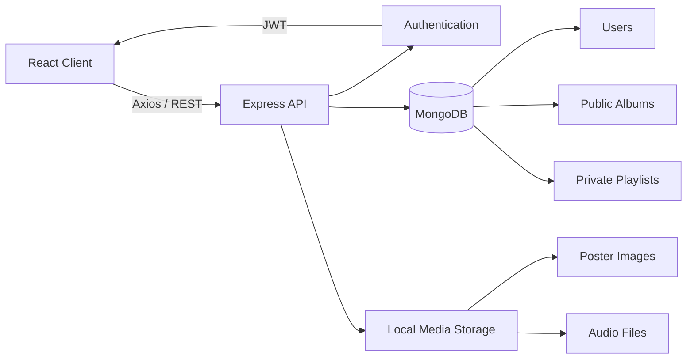

# 🎧 Gourav Music Studio

<div align="center">

**A full-stack music streaming experience built with the MERN stack.**

Discover public albums, build personal playlists, upload your own tracks, and enjoy uninterrupted playback through a responsive Spotify-inspired interface.


</div>

---

## About the project

Gourav Music Studio is more than a static music-player interface. It is a complete client-server application with authentication, persistent playlists, media uploads, protected user data, and a reusable global audio engine.

The project demonstrates practical full-stack development: React state management, REST API design, JWT-based authentication, MongoDB data modelling, multipart file uploads, protected routes, and responsive UI engineering.

## Highlights

- 🔐 **User authentication** — secure signup and login using bcrypt password hashing and JSON Web Tokens
- 💿 **Public music library** — browse albums and start an entire album with one click
- 🎵 **Full audio player** — play, pause, seek, mute, adjust volume, and navigate between tracks
- 📚 **Dynamic song library** — the sidebar updates according to the currently selected album
- ✨ **Personal playlists** — every authenticated user gets a private music collection
- 📤 **Media uploads** — upload playlist artwork and multiple audio files using multipart forms
- 🔀 **Mixed playlist creation** — combine uploaded tracks with songs from the existing library
- 📱 **Responsive experience** — adaptive album grid, mobile navigation drawer, horizontal mobile library, and compact player controls
- 🔔 **User feedback** — toast notifications for authentication and playlist actions
- 🗄️ **Persistent storage** — users, albums, and playlists are stored in MongoDB

## Application flow



## Core user journey

1. Create an account or sign in.
2. Browse albums available in the public music library.
3. Select an album to populate the library and start playback.
4. Control playback globally through the persistent player bar.
5. Create a private playlist using uploaded songs, existing tracks, or both.
6. Revisit personal playlists from **Your Playlist**.

## Tech stack

| Area | Technologies |
| --- | --- |
| Frontend | React 18, React Router 6, Context API, Axios |
| UI | Bootstrap 5, Bootstrap Icons, custom responsive CSS |
| Forms & feedback | React Select, React Toastify |
| Backend | Node.js, Express 5 |
| Database | MongoDB, Mongoose |
| Authentication | JWT, bcryptjs |
| File handling | Multer, Express static middleware |
| Audio | HTML5 Audio API |

## Architecture

The application is split into two independent packages:

```text
gourav-music-studio/
├── musicstudio/                  # React frontend
│   ├── public/
│   └── src/
│       ├── components/           # Navbar, sidebar, cards, footer, player
│       ├── context/              # Shared audio-player state and controls
│       ├── pages/                # Application screens
│       ├── App.jsx               # Routing and protected routes
│       └── index.css             # Global and responsive styling
│
└── musicstudio-backend/          # Express backend
    ├── config/                   # MongoDB connection
    ├── controllers/              # API business logic
    ├── middleware/               # JWT verification and file uploads
    ├── models/                   # Mongoose schemas
    ├── public/
    │   ├── images/               # Uploaded playlist artwork
    │   └── songs/                # Uploaded audio files
    ├── routes/                   # REST endpoints
    └── server.js                 # Server entry point
```

## Data model

The backend uses three main collections:

- **User** — name, unique email, hashed password, and timestamps
- **Album** — title, poster, tracks, and timestamps
- **PrivateAlbum** — playlist owner, title, poster, tracks, and timestamps

Private playlists reference their owner through a MongoDB `ObjectId`, ensuring that authenticated users only receive their own collections.

## API overview

| Method | Endpoint | Access | Purpose |
| --- | --- | --- | --- |
| `POST` | `/api/auth/signup` | Public | Register a new user |
| `POST` | `/api/auth/login` | Public | Authenticate and receive a JWT |
| `GET` | `/api/albums` | Public | Retrieve all public albums |
| `GET` | `/api/songs` | Public | Retrieve the shared song library |
| `POST` | `/api/create` | Public | Create a public album with uploaded media |
| `GET` | `/api/private/albums` | Protected | Retrieve the current user's playlists |
| `POST` | `/api/private/create` | Protected | Create a private playlist |

Protected endpoints expect the following header:

```http
Authorization: Bearer <token>
```

## Getting started

### Prerequisites

Install the following before running the project:

- [Node.js](https://nodejs.org/) 18 or newer
- npm
- A local MongoDB server or [MongoDB Atlas](https://www.mongodb.com/atlas) connection

### 1. Clone the repository

```bash
git clone https://github.com/Gourav7581/gourav-music-studio.git
cd gourav-music-studio
```

### 2. Configure the backend

```bash
cd musicstudio-backend
npm install
```

Create `musicstudio-backend/.env`:

```env
PORT=5000
MONGO_URI=your_mongodb_connection_string
JWT_SECRET=your_long_random_secret
```

> Never commit the real `.env` file or expose database credentials and JWT secrets.

Start the API server:

```bash
npm run dev
```

The backend runs at `http://localhost:5000`.

### 3. Configure the frontend

Open another terminal:

```bash
cd musicstudio
npm install
npm start
```

The React application opens at `http://localhost:3000`.

## Available scripts

### Frontend

```bash
npm start       # Start the development server
npm run build   # Create an optimized production build
```

### Backend

```bash
npm start       # Run the API with Node.js
npm run dev     # Run the API with Nodemon
```

## Engineering decisions

- **Context API for playback:** one audio engine is shared across the library, album cards, and player controls without prop drilling.
- **Separated controllers and routes:** HTTP routing stays concise while database and response logic remains independently organized.
- **JWT middleware:** authentication is handled once and reused across private-playlist endpoints.
- **Normalized media responses:** stored filenames are converted into browser-ready URLs by the API.
- **Reusable components:** navigation, album cards, sidebar, player, and footer remain consistent across pages.
- **Responsive-first overrides:** desktop, tablet, and mobile layouts preserve access to both the library and playback controls.

## Future improvements

- Search and filter across songs and albums
- Edit and delete personal playlists
- Favourite tracks and listening history
- Role-based administration
- Cloud media storage for production deployments
- Automated frontend and API tests
- Centralized environment-based API configuration

## Author

Built by **Gourav** as a full-stack portfolio project focused on modern React development, REST APIs, authentication, media handling, and responsive product design.

If you found this project useful or interesting, consider giving the repository a ⭐.

